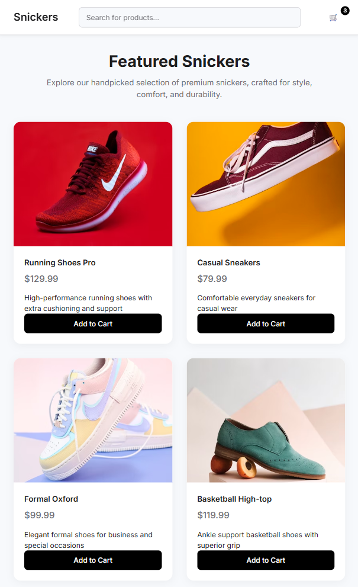
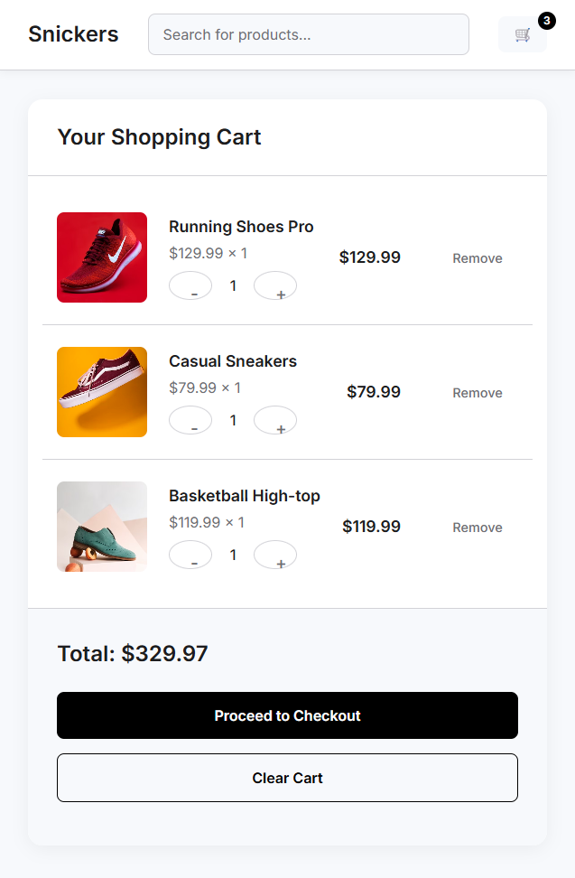

# Snickers - A React eCommerce Store

A simple and modern eCommerce store for shoes, built with React and Vite.

## Screenshots





## Features

*   Browse a catalog of featured snickers.
*   Add products to your shopping cart.
*   Update quantities and remove items from the cart.
*   Search for products.
*   A clean and responsive user interface.

## Technologies Used

*   [React](https://reactjs.org/)
*   [Vite](https://vitejs.dev/)
*   [React Router](https://reactrouter.com/)
*   CSS for styling

## Getting Started

To get a local copy up and running, follow these simple steps.

### Prerequisites

*   npm
    ```sh
    npm install npm@latest -g
    ```

### Installation

1.  Clone the repo
    ```sh
    git clone https://github.com/your_username_/Project-Name.git
    ```
2.  Install NPM packages
    ```sh
    npm install
    ```
3.  Run the development server
    ```sh
    npm run dev
    ```